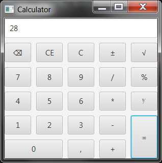

# javafx-calculator
Calculator based on JavaFX, JUnit, Spock, Kotlin

* [Main.kt](/src/kotlin/com/example/javafx/calculator/Main.kt) main Application class
* [calculator.fxml](/src/resources/calculator.fxml) contains window layout
* [Calculator.kt](/src/kotlin/com/example/javafx/calculator/Calculator.kt) contains logic 
* [CalculatorSpec.groovy](/src/test/groovy/com/example/javafx/calculator/CalculatorSpec.groovy) contains test\specification
